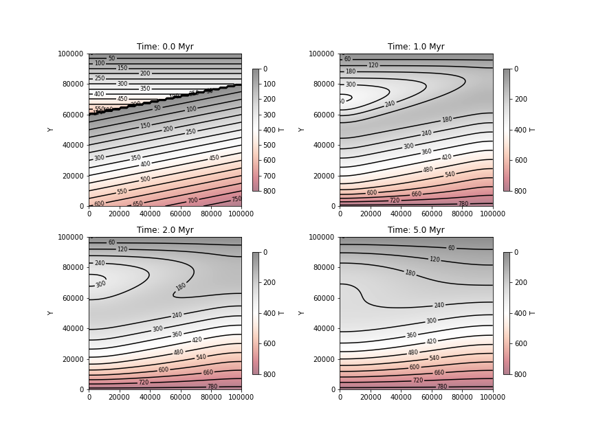
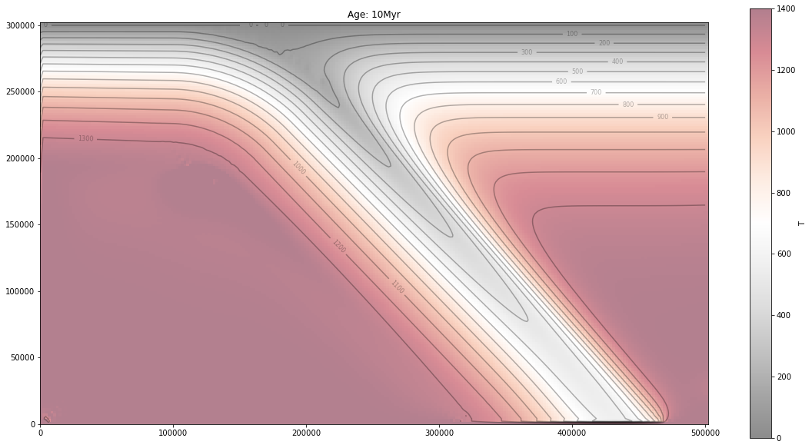
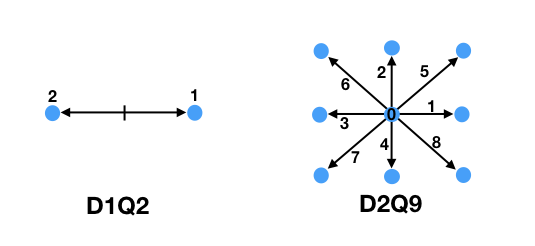

# Summary
Geodynamics involves the application of static and dynamic analysis techniques to geological problems, generally using a continuum approach. Modern geodynamics codes face challenges of small-scale resolution of geological features, non-linear rheologies of geomaterials, and problem dimensionality [@Moresi:2007]. Generally these codes are optimised to run high-performance computing environments, and have both significant computing overheads, and steep learning curves for initiates or students.

However, a subset of problems directly relevant to geology may be approached by basic advection-diffusion solvers, particularly in 2D. Such problems include basic heat diffusion from an initial condition (eg. igneous intrusion), advection of heat in a known or prescribed flow field (eg. subduction zones), or the development of a flow field given appropriate system boundary conditions (eg. convection, groundwater flow) [@Turcotte:2002; @Fowler:2005]. These problems are often of direct relevance to geologists, both academically and in industry, but also lay the foundations for geodynamic understanding in teaching environments.

*Figure 1. Simulation of a cooling crustal thrust structure*

``Planet_LB`` introduces D1Q2 and D2Q9 Lattice-Boltzmann solvers for the solution of basic planetary geodynamics problems [@Mohamad:2019]. The functionality is packaged to take the complexity of the solution step out of the basic geodynamic exercise, operating as a gateway code to the world of Earth-science simulation and modelling.  

# Statement of Need

The pedagogy of geodynamics teaching may considered as two end-members: i) approaching problems of crustal and lithosphere dynamics from a conceptual or mathematical approach, often tied with observational data, or ii) approaching geodynamics from the computational simulation of crust-mantle processes. The clear advantages of the latter approach include quantification of the problem, visualisation of the processes involved, and a predictive framework for assessing Earth observations. The main drawback from the approach is that open-source geodynamic tools are designed for high-performance computing environments, generally using low-level codes like C or fortran, and often require a high level of computational proficiency from the student. This can be challenging for Earth Science majors. 

The goal of ``Planet_LB`` is to bridge the accessibility gap in geodynamics tools both for the classroom, and for the non-numerical geoscientists. It can be run in an existing python environment (eg. Anaconda), and requires minimal dependencies beyond basic scientific and numerical python libraries. It is available for installation via pip. Very few existing geodynamic codes utilise Lattice-Boltzmann methods (the majority implementing finite element (eg. @Moresi:2007), finite volume or finite difference methods), and thus ``Planet_LB`` fills an important instructional gap in demonstrating the application of Lattice-Boltzmann approaches to geoscience problems.  

A large number of worked Jupyter notebooks are provided, which provide solutions to a number of classic geodynamical problems. The problems introduced in the notebooks include 1D time-dependent thermal modelling and oceanic geotherms, 2d thermal modelling of thrusted continental crust, the thermal decay of an intruded granite body, forced 2D cavity-driven lid flow, and simulating the thermal structure of a subduction zone. Both 1D oceanic geotherms, and 2D lid-driven cavity flow, have analytical solutions and are used as benchmarks for the routines. The notebooks are intended to both a) provide clear templates to obtain quantitative thermal or dynamic information from common 1D or 2D geodynamic problems, and b) provide a verbose introduction to the numeric expression of geodynamic problems, and develop student's capacity in modelling and simulation. 

 
*Figure 2. Example of a modelled subduction zone*

# Functionality and Usage

The basic Lattice Boltzmann approach involves a statistical mechanics approach to molecular distributions, where the Boltzmann transport equation is solved using discrete 'collision' and 'streaming' steps. We use the Bhatnagar, Gross, and Krook (BGK) approximation for the collision operator (see [@Mohamad:2019]), and under this approximation the discrete form of the equation under one dimension is:

$$ f_i(r+c_i \Delta t, t + \Delta t) = f_i(r,t) + (\Delta t/{\tau})[f^{eq}_i(r,t) - f_i(r,t)]$$ 

The underlying grid is structured as shown in Figure 3, and the node numbering scheme is used both in the collision operator step (each node is weighted differently relative to the cell centre), and in the streaming step with advects the underlying distribution function, subject to boundary conditions. For full details of Lattice-Boltzmann implementation, see @Mohamad:2019.

*Figure 3. Examples of LB grid structure and node numbering*

As noted, the library can be installed via pip (*pip install planet_LB*), and extensive examples of usage are found in the associated ipynbs on github. The code itself develops a Lattice-Boltzmann data structure which contains the details of the simulation parameters, grid, initial conditions, and boundary conditions, and this may be iteratively sent to an appropriate solver (D2Q9, or D1Q2, for either diffusion, advection, or some combination of these depending on the geodynamic problem), allowing the time-evolution of a simulation to be tracked. As the future system state depends on its current state, system information is updated and interatively solved within a loop of small timesteps, defined by flow stability conditions (furthers details of the timestepping are developed in the file *thrust_fault.ipynb*).

The github project implements a continuous integration approach to code development, with small benchmark problems executed as test suits on linux instances on github (utilising a ubuntu instance with linting via flake8, and pytest). 

The teaching experience of the code has been that is has lowered the threshold to quantative geodynamics, in both keeping the mechanics of solvers under the hood, and focussing on relevant geodynamic factors to the problem at hand (eg. experimenting with plate age and thermal structure of subducting slabs, rather than spending time developing/learning solutions to the diffusion equation). The readability of the front-end python code, and the ability to extensively document Jupyter notebooks, has likewise enabled 3rd-year Earth science majors to focus on the geodynamics of these systems, rather than spending excessive time of development or numerical underpinnings. 

# Acknowledgements
CO thanks the 3rd geodynamic cohorts he has inflicted python on over the years.

# References
